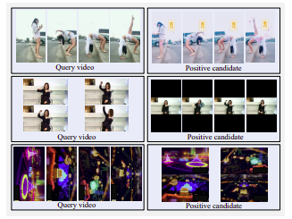
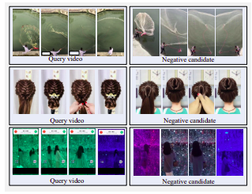
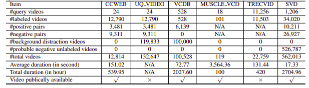

# Near Duplicate Video Retrieval

We have witnessed an explosive growth of video data in a variety of video sharing websites with billions of videos being available on the internet,
it becomes a major challenge to perform near-duplicate video retrieval (NDVR) from a large-scale video database. NDVR aims to retrieve the near-duplicate
videos from a massive video database, where near-duplicate videos are defined as videos that are visually close to the original videos.

Users have a strong incentive to copy a trending short video & upload an augmented version to gain attention. With the growth of short videos, new
difficulties and challenges for detecting near duplicate short videos appears.

Here, we have built a Neural Search solution using Jina to solve the challenge of NDVR.


**Table of Contents**

- [Near Duplicate Video Retrieval](#near-duplicate-video-retrieval)
  - [How does it look like?](#how-does-it-look-like)
  - [Challenges](#challenges)
  - [Data](#data)
  - [Prerequirements](#prerequirements)
    - [Download the data](#download-the-data)
  - [Run Index Flow](#run-index-flow)
  - [Run Query Flow](#run-query-flow)

## How does it look like?



<sub>Example of hard positive candidate videos.
Top row: side morrored, color-filtered, and waterwashed.
Middle row: horizontal screen changed to vertical screen with large black margins.
Botton row: rotated</sub>

## Challenges



<sub>Example of hard negative videos. All the candidates are
visually similar to the query but not near-duplicates.</sub>

## Data

There are three strategies for selecting candidate videos:
1. Iterative Retrieval
2. Transformed Retrieval
3. Feature Based Mining

We decided to go with Transformed Retrieval strategy due to the time & resource constraint.
In real applications, users would copy trending videos for personal incentives. Users usually choose to modify their copied videos slightly to bypass the detection. These modifications contain video cropping, border insertion and so on.

To mimic such user behavior, we define one temporal transformation, i.e., video speeding, and three spatial transformations, i.e., video cropping, black border insertion, and video rotation.

Unfortunately, the NDVR datasets researched upon were either low resoluation or huge or domain specfic or not publicly available(we contacted few personally as well). Hence, we decided to create our small custom dataset to experiment on.




## Prerequirements

```bash
pip install --upgrade -r requirements.txt
```

### Download the data

```bash
bash ./get_data.sh
```

## Run Index Flow

```bash
python app.py -t index
```

The index Flow is defined as follows:
```yaml
!Flow
with:
  logserver: false
pods:
  chunk_seg:
    uses: craft/craft.yml
    parallel: $PARALLEL
    read_only: true
    timeout_ready: 600000
  tf_encode:
    uses: encode/encode.yml
    needs: chunk_seg
    parallel: $PARALLEL
    read_only: true
    timeout_ready: 600000
  chunk_idx:
    uses: index/chunk.yml
    shards: $SHARDS
    separated_workspace: true
  doc_idx:
    uses: index/doc.yml
    needs: gateway
  join_all:
    uses: _merge
    needs: [doc_idx, chunk_idx]
    read_only: true
```

This breaks down into the following steps:
1. Segment each video into keyframes (chunks);
   1. Key-frames are defined as the representative frames of a video stream, the frames that  provide the most accurate and compact summary of the video content.
   2. It would be an efficient way to encode Videos, as a lot of frames are redundant.
   3. We did some time analysis on Keyframe extraction. It takes around 17 seconds to extract 15 keyframes of a 5 min(17 Mb) video.
2. Encode each keyframe (chunk) as a fixed-length vector;
3. Store all vector representations in a vector database with *shards*.

</details>

Here we use a YAML file to define a Flow and use it to index the data. The `index` function takes a `input_fn` param which takes an Iterator to pass file paths, which will be further wrapped in an `IndexRequest` and sent to the Flow.

```python
DATA_BLOB = "./index-videos/*.mp4"
if task == "index":
    f = Flow().load_config("flow-index.yml")
    with f:
        f.index(input_fn=input_index_data(DATA_BLOB, size=num_docs), batch_size=2)
```

```python
def input_index_data(patterns, size):
    def iter_file_exts(ps):
        return it.chain.from_iterable(glob.iglob(p, recursive=True) for p in ps)

    d = 0
    if isinstance(patterns, str):
        patterns = [patterns]
    for g in iter_file_exts(patterns):
        yield g.encode()
        d += 1
        if size is not None and d > size:
            break
```


## Run Query Flow

```bash
python app.py -t query
```

You can then open [Jinabox](https://jina.ai/jinabox.js/) with the custom endpoint `http://localhost:45678/api/search`

The query Flow is defined as follows:

```yaml
!Flow
with:
  logserver: true
  read_only: true  # better add this in the query time
pods:
  chunk_seg:
    uses: craft/index-craft.yml
    parallel: $PARALLEL
  tf_encode:
    uses: encode/encode.yml
    parallel: $PARALLEL
  chunk_idx:
    uses: index/chunk.yml
    shards: $SHARDS
    separated_workspace: true
    polling: all
    uses_reducing: _merge_all
    timeout_ready: 100000 # larger timeout as in query time will read all the data
  ranker:
    uses: BiMatchRanker
  doc_idx:
    uses: index/doc.yml
```


The query flow breaks down into the following steps:
1. Do steps 1,2 in the index flow for each incoming query;
2. Retrieve relevant chunks from database;
3. Aggregate the chunk-level score back to document-level;
4. Return the top-k results to users.

